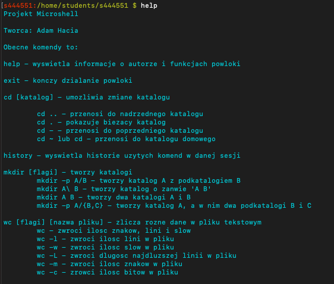
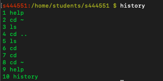
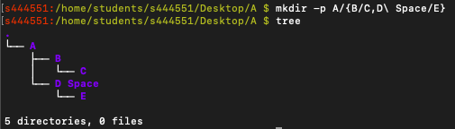
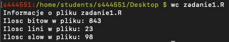
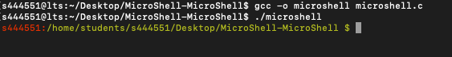

# MicroShell
> Simple shell written in C. Fully working on Linux and MacOs. Project for Operating Systems classes. 
## Table of contents
- [MicroShell](#microshell)
  - [Table of contents](#table-of-contents)
  - [Screenshots](#screenshots)
  - [Technologies](#technologies)
  - [Setup](#setup)
  - [Features](#features)
  - [Status](#status)
  - [Contact](#contact)

## Screenshots

```help``` function



```history``` function



```mkdir``` function



```wc``` function



## Technologies
* C

## Setup
1. Compile ```microshell.c``` file with ```gcc -o microshell microshell.c```
2. Run app with ```./microshell```



## Features
* Own versions of "cd", "wc", "mkdir", "history" and "help" command.
* Use other bash functions  (created by using ```execvp```)
* Customized colorful path with name of logged user


## Status
Project is: _completed_

## Contact
Created by [@HondaPL](https://hacia.students.wmi.amu.edu.pl/) 2019

